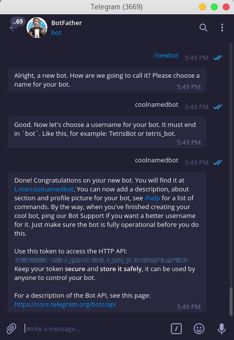

# [Telegram bot: Meme Bot](https://t.me/it_meme_bot)

***

### The final project for the "Python Backend Developer" course at the "robot_dreams" IT-School

### About project: [Landing page](https://yurii-polych.github.io/) 

### Requirements

***

* Python 3.10+
* Telegram account
* [Docker](https://www.docker.com/products/docker-desktop/)
* [ngrok](https://ngrok.com/)
* PostgreSQL

### Before installation

***

##### Create the bot on telegram first

To create a chatbot on Telegram, you need to contact the [BotFather](https://telegram.me/BotFather), which is essentially a bot used to create other bots.

The command you need is `/newbot` which leads to the following steps to create your bot:

Your bot should have two attributes: a name and a username. The name will show up for your bot, while the username will be used for mentions and sharing.

After choosing your bot name and username—which must end with “bot”—you will get a message containing your access token, and you’ll obviously need to save your access token and username for later, as you will be needing them.

##### Third-party APIs

Meme Bot uses the following third-party APIs:

* [Programming Memes Images API](https://rapidapi.com/kaushalsharma880-GAglnDIvTy/api/programming-memes-images)
Follow this link and get your X-RapidAPI-Key and X-RapidAPI-Host
* [Geocoding API](https://open-meteo.com/en/docs/geocoding-api)
* [Weather Forecast API](https://open-meteo.com/en/docs#api_form)
* [TelegramBot API](https://core.telegram.org/bots/api)

### Installation

***

##### For Windows:

1. Clone this repository `git clone https://github.com/yurii-polych/final-project`
2. Create your virtual environment `python3 -m venv venv`
3. Activate it: `venv\Scripts\activate`
4. Install all requirements `pip install -r requirements.txt`
5. Create a file named _**.env**_ in the project's root folder based on _**.env.template**_ and provide data for all the arguments.
To get your _**WEBHOOK**_ follow instructions [ngrok](https://ngrok.com/download).
6. Run the bot with python run.py

##### Docker

1. Clone this repository `git clone https://github.com/yurii-polych/final-project`
2. Create a file named _**.env**_ in the project's root folder based on _**.env.template**_ and provide data for all the arguments.
3. `docker-compose build`
4. `docker-compose up`
